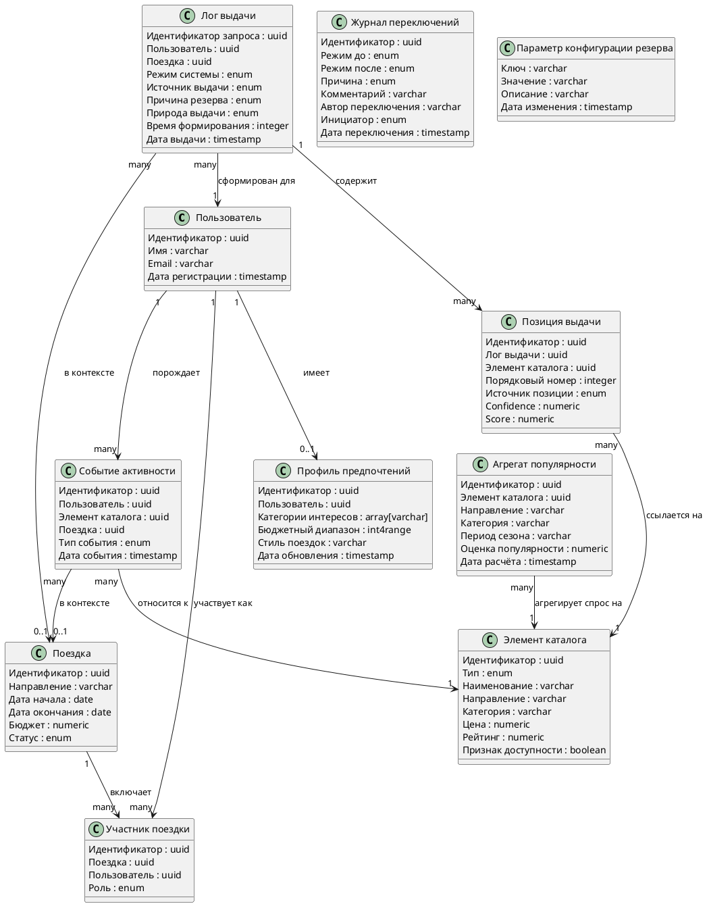

# Описание логической модели: Сервис рекомендаций (резервный сценарий)

## История изменений

*Обязательный к заполнению раздел.*

| Версия | Дата | Автор | Задача | Описание изменения |
|--------|------|-------|--------|--------------------|
| 1.0 | 04.07.2026 | kkw | Кейс «Опять сломали ML» | Сформирована начальная версия документа |
| 1.1 | 05.07.2026 | kkw | Кейс «Опять сломали ML» | Правки по ревью: атрибуты «Комментарий» и «Автор переключения» в журнале переключений, причина `reserve_unavailable` в логе выдачи |

## Логическая модель данных

> ℹ️ Представление логической модели данных в виде диаграммы классов UML.
> Модель покрывает данные, необходимые резервному сценарию рекомендаций: источники резервного расчёта (профиль, история, агрегаты популярности), контекст поездки и служебные сущности наблюдаемости.

Пояснения к модели:

- **Агрегат популярности** не содержит ссылок на пользователей – batch-джоба читает события активности обезличенно и сохраняет только статистику спроса. Это обеспечивает требование «популярность у анонимных пользователей» и вызов кейса «персонализация без утечки данных».
- **Лог выдачи** и **Позиция выдачи** – аналитические сущности: по ним считается CTR по источникам (`ml` / `hybrid` / `fallback`) и оценивается деградация конверсии в резервном режиме. Это фиксация уже отданных ответов, а не кэш предсказаний.
- **Журнал переключений** – аудит работы circuit breaker для post-mortem и алертинга.
- Предсказания ML-модели в модели данных **намеренно отсутствуют** – по ограничению кейса они не хранятся и не кэшируются наперёд.

## Описание сущностей

### Пользователь

| Атрибут | Описание | Тип | Обязательность | Значение по умолчанию |
|---------|----------|-----|----------------|----------------------|
| Идентификатор | Уникальный идентификатор пользователя | uuid | да | генерируется |
| Имя | Отображаемое имя пользователя | varchar | да | |
| Email | Электронная почта | varchar | да | |
| Дата регистрации | Дата и время создания учётной записи | timestamp | да | текущее время |

### Профиль предпочтений

| Атрибут | Описание | Тип | Обязательность | Значение по умолчанию |
|---------|----------|-----|----------------|----------------------|
| Идентификатор | Уникальный идентификатор записи профиля | uuid | да | генерируется |
| Пользователь | Ссылка на пользователя | uuid | да | |
| Категории интересов | Заявленные интересы (пляж, музеи, гастрономия и т.п.) | array[varchar] | нет | пустой массив |
| Бюджетный диапазон | Предпочитаемый диапазон расходов | int4range | нет | |
| Стиль поездок | Стиль путешествий (семейный, активный, люкс и т.п.) | varchar | нет | |
| Дата обновления | Момент последнего изменения профиля | timestamp | да | текущее время |

### Событие активности

| Атрибут | Описание | Тип | Обязательность | Значение по умолчанию |
|---------|----------|-----|----------------|----------------------|
| Идентификатор | Уникальный идентификатор события | uuid | да | генерируется |
| Пользователь | Ссылка на пользователя | uuid | да | |
| Элемент каталога | Ссылка на элемент каталога | uuid | да | |
| Поездка | Ссылка на поездку, в контексте которой произошло событие | uuid | нет | |
| Тип события | Вид активности: `view` / `booking` / `rating` / `feedback` | enum | да | |
| Дата события | Дата и время события | timestamp | да | текущее время |

### Поездка

| Атрибут | Описание | Тип | Обязательность | Значение по умолчанию |
|---------|----------|-----|----------------|----------------------|
| Идентификатор | Уникальный идентификатор поездки | uuid | да | генерируется |
| Направление | Город/страна назначения | varchar | да | |
| Дата начала | Дата начала поездки | date | да | |
| Дата окончания | Дата окончания поездки | date | да | |
| Бюджет | Плановый бюджет поездки | numeric | нет | |
| Статус | Состояние поездки: `draft` / `planned` / `active` / `finished` | enum | да | `draft` |

### Участник поездки

| Атрибут | Описание | Тип | Обязательность | Значение по умолчанию |
|---------|----------|-----|----------------|----------------------|
| Идентификатор | Уникальный идентификатор записи участия | uuid | да | генерируется |
| Поездка | Ссылка на поездку | uuid | да | |
| Пользователь | Ссылка на пользователя | uuid | да | |
| Роль | Роль в поездке: `organizer` / `member` | enum | да | `member` |

### Элемент каталога

| Атрибут | Описание | Тип | Обязательность | Значение по умолчанию |
|---------|----------|-----|----------------|----------------------|
| Идентификатор | Уникальный идентификатор элемента | uuid | да | генерируется |
| Тип | Тип элемента: `hotel` / `activity` / `route` | enum | да | |
| Наименование | Название отеля/активности/маршрута | varchar | да | |
| Направление | Город/регион, к которому относится элемент | varchar | да | |
| Категория | Категория внутри типа (пляжный отель, музей, треккинг и т.п.) | varchar | да | |
| Цена | Ориентировочная стоимость | numeric | нет | |
| Рейтинг | Средняя оценка пользователей | numeric | нет | |
| Признак доступности | Доступен ли элемент к бронированию | boolean | да | `true` |

### Агрегат популярности

| Атрибут | Описание | Тип | Обязательность | Значение по умолчанию |
|---------|----------|-----|----------------|----------------------|
| Идентификатор | Уникальный идентификатор агрегата | uuid | да | генерируется |
| Элемент каталога | Ссылка на элемент каталога | uuid | да | |
| Направление | Направление, по которому считалась популярность | varchar | да | |
| Категория | Категория элемента | varchar | да | |
| Период сезона | Период агрегации (например, `2026-Q3`, `summer`) | varchar | да | |
| Оценка популярности | Нормированная оценка спроса `0..1` (обезличенная статистика) | numeric | да | |
| Дата расчёта | Момент расчёта агрегата batch-джобой | timestamp | да | |

### Лог выдачи

| Атрибут | Описание | Тип | Обязательность | Значение по умолчанию |
|---------|----------|-----|----------------|----------------------|
| Идентификатор запроса | Уникальный идентификатор запроса выдачи (requestId) | uuid | да | генерируется |
| Пользователь | Кому сформирована выдача | uuid | да | |
| Поездка | В контексте какой поездки | uuid | нет | |
| Режим системы | Режим на момент запроса: `NORMAL` / `DEGRADED` / `RECOVERY` | enum | да | |
| Источник выдачи | Итоговый источник: `ml` / `hybrid` / `fallback` | enum | да | |
| Причина резерва | `timeout` / `ml_error` / `low_confidence` / `circuit_open` / `manual` / `reserve_unavailable`; пусто для `source = ml` | enum | нет | |
| Природа выдачи | `personalized` / `popular` – определяет заголовок виджета | enum | да | |
| Время формирования | Длительность формирования ответа, мс | integer | да | |
| Дата выдачи | Дата и время формирования выдачи | timestamp | да | текущее время |

### Позиция выдачи

| Атрибут | Описание | Тип | Обязательность | Значение по умолчанию |
|---------|----------|-----|----------------|----------------------|
| Идентификатор | Уникальный идентификатор позиции | uuid | да | генерируется |
| Лог выдачи | Ссылка на лог выдачи | uuid | да | |
| Элемент каталога | Ссылка на рекомендованный элемент | uuid | да | |
| Порядковый номер | Позиция в выдаче, начиная с 1 | integer | да | |
| Источник позиции | Откуда позиция: `ml` / `fallback` | enum | да | |
| Confidence | Уверенность модели; заполняется только для позиций с источником `ml` | numeric | нет | |
| Score | Оценка резервного скоринга; заполняется только для позиций с источником `fallback` | numeric | нет | |

### Журнал переключений

| Атрибут | Описание | Тип | Обязательность | Значение по умолчанию |
|---------|----------|-----|----------------|----------------------|
| Идентификатор | Уникальный идентификатор записи | uuid | да | генерируется |
| Режим до | Режим до переключения: `NORMAL` / `DEGRADED` / `RECOVERY` | enum | да | |
| Режим после | Режим после переключения | enum | да | |
| Причина | `error_rate` / `consecutive_failures` / `timer_expired` / `probe_success` / `probe_failure` / `manual` | enum | да | |
| Комментарий | Свободный текст причины; для ручных переключений – из поля `reason` запроса kill switch | varchar | нет | |
| Автор переключения | Идентификатор сотрудника, выполнившего ручное переключение; заполняется при `Инициатор = manual` | varchar | нет | |
| Инициатор | `auto` (circuit breaker) / `manual` (kill switch) | enum | да | `auto` |
| Дата переключения | Дата и время переключения | timestamp | да | текущее время |

### Параметр конфигурации резерва

| Атрибут | Описание | Тип | Обязательность | Значение по умолчанию |
|---------|----------|-----|----------------|----------------------|
| Ключ | Имя параметра (например, `ml.timeout`, `confidence.itemThreshold`) | varchar | да | |
| Значение | Значение параметра в строковом представлении | varchar | да | |
| Описание | Назначение параметра | varchar | нет | |
| Дата изменения | Момент последнего изменения | timestamp | да | текущее время |

## Связанные документы

| № | Описание |
|---|----------|
| 1 | [Резервный сценарий рекомендаций – основной документ решения](../Резервный%20сценарий%20рекомендаций.md) |
| 2 | [REST API GET – Получение рекомендаций](../api/REST%20API%20GET%20-%20Получение%20рекомендаций.md) |
