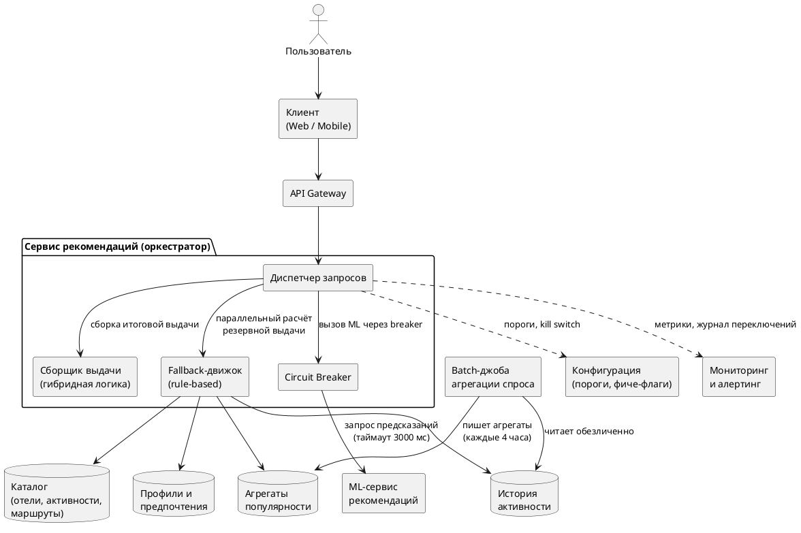
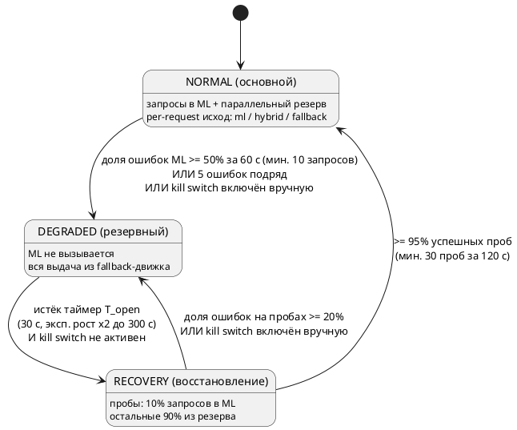
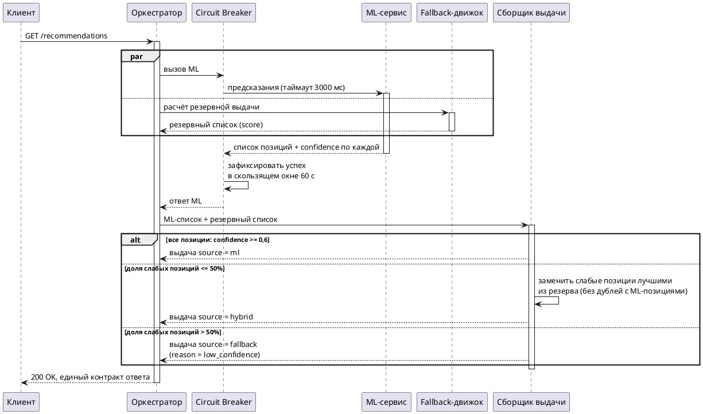
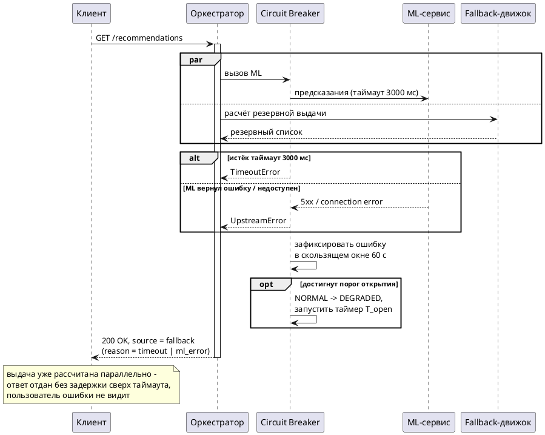
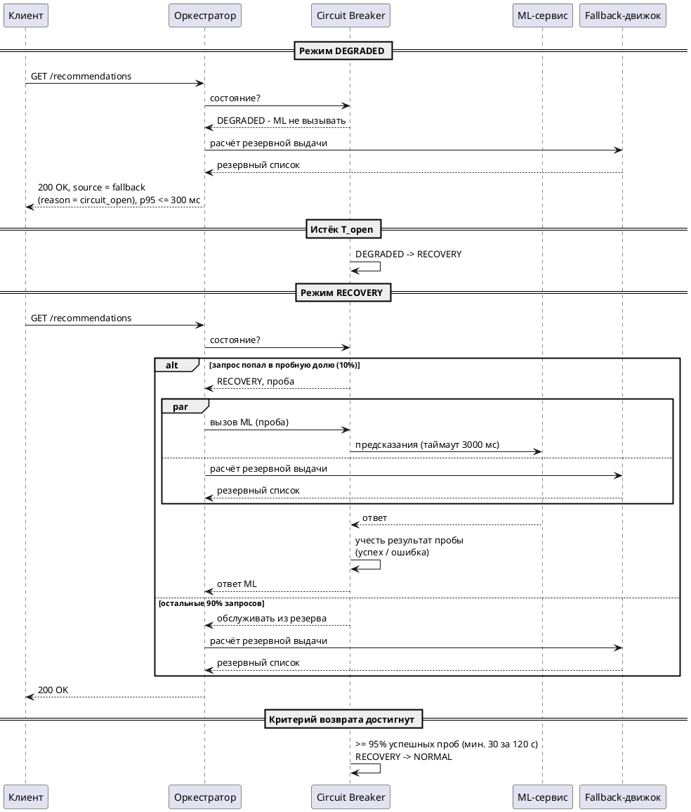
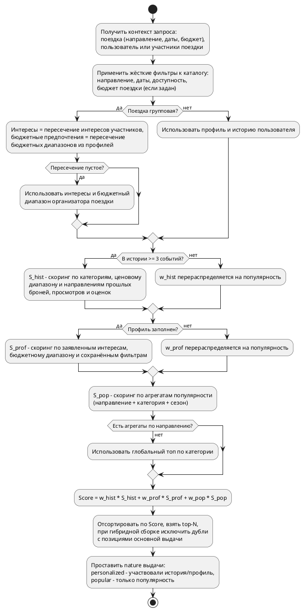

# Резервный сценарий персонализированных рекомендаций (fallback)

> Основной документ решения кейса «Опять сломали ML» (TravelTech).
> Описывает механизм деградации функции рекомендаций: детекцию сбоя, переключение режимов, резервный алгоритм и восстановление.

## История изменений

*Обязательный к заполнению раздел.*

| Версия | Дата | Автор | Задача | Описание изменения |
|--------|------|-------|--------|--------------------|
| 1.0 | 04.07.2026 | kkw | Кейс «Опять сломали ML» | Сформирована начальная версия документа |
| 1.1 | 05.07.2026 | kkw | Кейс «Опять сломали ML» | Правки по ревью: бюджетная модель групповых поездок, вызов ML через circuit breaker (С1, С3), kill switch из RECOVERY, причина `reserve_unavailable`, параметр `output.maxItems` |

## Контекст и постановка задачи

Сервис TravelTech использует ML-модель для персонализированных рекомендаций (отели, активности, маршруты). Требуется смоделировать резервный сценарий, который включается при:

1. отказе ML-сервиса;
2. задержке ответа более 3 секунд;
3. возврате моделью данных с низким confidence.

Требования к решению:

- обеспечить непрерывность UX – пользователь не видит ошибок, пустых блоков и заметных задержек;
- использовать в резерве только внутренние данные: история пользователя, профиль, популярность у анонимных пользователей;
- поддерживать плавное переключение между основным и резервным режимом (без «дребезга»);
- **ограничение:** нельзя кэшировать предсказания модели наперёд – интересы быстро устаревают.

## Термины и определения

| Термин | Определение |
|--------|-------------|
| ML-сервис | Внутренний сервис инференса ML-модели рекомендаций. Возвращает ранжированный список позиций с оценкой уверенности |
| Confidence | Оценка уверенности модели в релевантности конкретной позиции, число `0..1`, возвращается моделью для каждой позиции |
| Оркестратор рекомендаций | Сервис, принимающий запросы клиента, вызывающий ML-сервис и fallback-движок и собирающий итоговую выдачу |
| Fallback-движок | Rule-based компонент, рассчитывающий резервную выдачу только из внутренних данных (без ML-инференса) |
| Circuit breaker | Механизм переключения режимов: при серии сбоев ML-сервис исключается из цепочки вызовов, затем трафик возвращается постепенно |
| Гибридная выдача | Выдача, в которой позиции ML-модели с низким confidence заменены лучшими позициями резервного расчёта |
| Агрегаты популярности | Предрассчитанная обезличенная статистика спроса (топ позиций по направлению/категории/сезону). Статистика, а не предсказания модели |

## Границы решения

**Входит в объём:** формирование выдачи рекомендаций (отели, активности, маршруты) во всех режимах; детекция сбоев; переключение и восстановление; наблюдаемость; контракт API выдачи; ручное управление режимом.

**Не входит:** обучение и качество самой ML-модели, содержимое каталога, механика бронирования, push-уведомления.

## Архитектура решения

Ответственность компонентов: пороги confidence и правила сборки живут в **оркестраторе**, а не в ML-сервисе – бизнес-правило отделено от модели и меняется конфигурацией без релиза модели.

## Ключевые проектные решения

| № | Решение | Обоснование |
|---|---------|-------------|
| Р1 | **Параллельный расчёт резерва** при каждом запросе в основном режиме | Резервная выдача готова к моменту любого исхода вызова ML: при таймауте 3 с ответ пользователю отдаётся мгновенно, суммарная задержка не превышает таймаут. Резерв дешёвый (правила + чтение агрегатов, без инференса), поэтому накладные расходы допустимы. Кроме того, резерв в любом случае нужен для гибридной сборки (Р2) |
| Р2 | **Гибридная сборка по per-item confidence**: заменяются только слабые позиции | Модель редко «не уверена» во всей выдаче сразу; заменяя только слабые позиции, сохраняем максимум персонализации. Полный переход в резерв – только когда слабых позиций больше половины |
| Р3 | **Circuit breaker** на уровне режима системы | Fallback на уровне одного запроса не защищает от шторма запросов в мёртвый сервис и не даёт ему подняться. Breaker снимает нагрузку с ML-сервиса и делает переключение управляемым |
| Р4 | В резерве – **только внутренние данные**; агрегаты популярности предрассчитываются batch-джобой | Агрегаты – обезличенная статистика спроса, а не предсказания модели: ограничение «не кэшировать предсказания наперёд» не нарушается (см. раздел «Соответствие ограничению кэширования») |
| Р5 | **Единый контракт ответа** во всех режимах; технический источник выдачи – служебное поле | Клиент рендерит один и тот же виджет из любого режима – это и есть непрерывность UX. Поле `source` используется только клиентской аналитикой |
| Р6 | Заголовок виджета зависит от **природы выдачи**, а не от технического режима | Если резерв построен на истории/профиле – выдача персональная, заголовок «Подобрано для вас» сохраняется. Если доступна только популярность (холодный старт, аноним) – заголовок «Популярно у путешественников». Пользователь никогда не видит признаков сбоя, но продукт не выдаёт неперсональную подборку за персональную |
| Р7 | **Kill switch** – ручное принудительное включение резервного режима | Оперативный рычаг для дежурного инженера: плановые работы на ML-контуре, деградация качества модели, инциденты, которые автоматика не ловит |

## Режимы работы

| Режим | Поведение | Латентность выдачи (p95) |
|-------|-----------|--------------------------|
| `NORMAL` (основной) | Все запросы идут в ML + параллельный расчёт резерва. Итог каждого запроса: `ml`, `hybrid` или `fallback` – по правилам сборки | ≤ 800 мс, худший случай ≤ 3,2 с (таймаут + сборка) |
| `DEGRADED` (резервный) | ML не вызывается вовсе. Все запросы обслуживает fallback-движок | ≤ 300 мс |
| `RECOVERY` (восстановление) | 10 % запросов – пробы в ML (с тем же таймаутом и параллельным резервом), остальные 90 % обслуживаются из резерва | ≤ 300 мс для 90 % запросов |

### Диаграмма состояний переключателя режимов

### Параметры переключения

Все параметры хранятся в конфигурации и меняются без релиза. Значения стартовые, уточняются по метрикам эксплуатации.

| Параметр | Значение | Обоснование |
|----------|----------|-------------|
| `ml.timeout` | 3000 мс | Из условия кейса: задержка более 3 с – триггер резерва |
| `confidence.itemThreshold` | 0,6 | Per-item порог уверенности. Стартовое значение по офлайн-оценке качества модели; подбирается A/B-тестом |
| `hybrid.maxWeakShare` | 50 % | Если слабых позиций больше половины – гибрид теряет связность, честнее отдать полностью резервную выдачу |
| `breaker.window` | 60 с | Скользящее окно подсчёта ошибок |
| `breaker.errorRateToOpen` | ≥ 50 % при ≥ 10 запросах в окне | Быстрая реакция на массовый сбой; минимум запросов защищает от ложных срабатываний на низком трафике |
| `breaker.consecutiveFailures` | 5 подряд | Экспресс-открытие при полном отказе, не дожидаясь окна |
| `breaker.openDuration` | 30 с, при повторном провале ×2 до максимум 300 с | Даём сервису время подняться; экспоненциальный рост снижает давление при затяжном инциденте |
| `recovery.probeShare` | 10 % запросов | Пробный трафик мал настолько, чтобы повторный сбой не задел заметную долю пользователей |
| `recovery.successToClose` | ≥ 95 % успешных проб, минимум 30 проб за 120 с | Возврат только по статистически значимой выборке – защита от «дребезга» |
| `recovery.errorRateToReopen` | ≥ 20 % ошибок на пробах | Возврат в `DEGRADED` при рецидиве |
| `popularity.refreshInterval` | 4 часа | Популярность направлений инерционна; частота достаточна для актуальности агрегатов |
| `output.maxItems` | 100 | Максимальный размер формируемой выдачи (top-N в алгоритме резерва); дальше работает пагинация API |

**Гистерезис:** условия входа в резерв и выхода из него асимметричны – открываемся быстро (секунды), возвращаемся осторожно (минуты, через пробы). Ошибки типа таймаут и 5xx учитываются в breaker одинаково; **низкий confidence ошибкой не считается** – сервис жив, это деградация качества, она обрабатывается на уровне запроса (гибрид/полный резерв) и отдельным алертом (см. «Наблюдаемость»).

## Сценарии обработки запроса

### С1. Основной режим: штатная и гибридная выдача

Правила гибридной сборки:

1. Позиция ML-выдачи считается слабой, если её `confidence < confidence.itemThreshold`.
2. Слабые позиции заменяются верхними позициями резервного списка в порядке их `score`; резервная позиция не должна дублировать ни одну оставшуюся ML-позицию (dedup по идентификатору элемента каталога).
3. Сильные ML-позиции сохраняют свои места – выдача не перемешивается.
4. Если доля слабых позиций превышает `hybrid.maxWeakShare`, выдача целиком заменяется резервной.
5. У ML-позиций в ответе заполнен `confidence`, у резервных – только `score`; каждая позиция несёт признак `itemSource: ml | fallback`.

### С2. Таймаут или отказ ML-сервиса

### С3. Резервный режим и восстановление

## Алгоритм резервных рекомендаций (fallback-движок)

Резервная выдача строится **на лету при каждом запросе** только из внутренних данных. Три источника из условия кейса образуют взвешенный скоринг с каскадной деградацией по доступности данных.

Свойства алгоритма:

- **Стартовые веса:** `w_hist = 0,5`, `w_prof = 0,3`, `w_pop = 0,2`. При отсутствии источника его вес перераспределяется на популярность – формула не ломается ни при какой комбинации доступных данных.
- **Холодный старт** (новый пользователь: нет ни истории, ни профиля) – выдача строится целиком на популярности в контексте направления; `nature = popular`.
- **Групповые поездки:** интересы и бюджетные предпочтения – пересечение соответствующих данных из профилей участников; при пустом пересечении используются данные организатора поездки. Бюджетные предпочтения участвуют только в скоринге; жёсткий бюджетный фильтр один – бюджет поездки. Логика резерва прозрачна и объяснима – в отличие от ML это простые правила.
- **Жёсткие фильтры** (направление, даты, доступность, бюджет поездки) применяются в любом режиме – резерв не предлагает недоступное.
- **Приватность:** агрегаты популярности обезличены (batch-джоба читает историю без привязки к пользователям) – соответствует вызову кейса «персонализация без утечки данных» и формулировке «популярность у анонимных пользователей».
- **Скорость:** расчёт – это чтение предрассчитанных агрегатов и профиля + арифметика по правилам; укладывается в бюджет ≤ 300 мс без ML-инференса.
- **Размер выдачи:** top-N, где N = `output.maxItems` (см. параметры переключения); дальше работает пагинация API.

## Соответствие ограничению кэширования (P.S. кейса)

Ограничение: *нельзя кэшировать предсказания модели наперёд – интересы быстро устаревают*.

| Данные | Можно ли предрассчитывать/кэшировать | Почему |
|--------|--------------------------------------|--------|
| Выдача ML-модели (предсказания) | **Нет** – ни прогрев, ни повторное использование прошлых ответов | Прямое ограничение кейса: предсказания отражают быстро устаревающие интересы |
| Агрегаты популярности | Да, batch каждые 4 часа | Это обезличенная статистика спроса, а не предсказания модели. Популярность направлений инерционна |
| Каталог, профиль, история | Да (обычное хранение) | Исходные внутренние данные, не производные от модели |
| Снапшот уже отданной выдачи для пагинации | Да, TTL 15 минут | Фиксация уже показанного пользователю ответа ради консистентности страниц. «Наперёд» – значит до запроса; снапшот создаётся после формирования выдачи и не переиспользуется для новых выдач |

Резервная выдача всегда рассчитывается **в момент запроса** по актуальным профилю и истории – свежесть персонализации в резерве обеспечена самой схемой.

## Обеспечение непрерывности UX

1. **Единый контракт ответа** во всех режимах – клиент рендерит один и тот же виджет; во всех режимах возвращается `200 OK`.
2. **Латентные бюджеты** зафиксированы по режимам (см. таблицу режимов); благодаря параллельному расчёту резерва худший случай ограничен таймаутом ML + время сборки.
3. **Заголовок виджета** определяется полем `nature` (`personalized` → «Подобрано для вас», `popular` → «Популярно у путешественников») и не зависит от технического режима. Смена режима не перерисовывает уже отображённую выдачу – режим фиксируется на момент запроса.
4. **Консистентность пагинации:** первая страница фиксирует снапшот выдачи (TTL 15 минут); последующие страницы читаются из него – пользователь не видит перемешивания позиций между страницами даже при смене режима.
5. **Иерархия деградации – четыре уровня:**

| Уровень | Источник выдачи | Когда |
|---------|-----------------|-------|
| 1 | ML-выдача (полная или гибрид) | `NORMAL`, ML ответил вовремя |
| 2 | Rule-based резерв (история + профиль + популярность) | Таймаут/ошибка/низкий confidence/`DEGRADED` |
| 3 | Статический топ направлений из конфигурации (`source = fallback`, `fallbackReason = reserve_unavailable`, `nature = popular`) | Недоступны хранилища резерва (агрегаты, профили) |
| 4 | Блок рекомендаций скрывается, страница работает | Недоступен и уровень 3: ответ `503`, клиент прячет виджет без ошибки на экране |

Статический топ уровня 3 – редакционный список в конфигурации сервиса (обновляется вручную), тоже не является предсказаниями модели.

## Наблюдаемость

### Метрики

| Метрика | Тип | Назначение |
|---------|-----|------------|
| `recommendations_source_total{source=ml\|hybrid\|fallback}` | counter | Доля выдач по источникам – главный индикатор здоровья функции |
| `ml_request_duration_seconds` | histogram | Латентность ML: p50/p95/p99, приближение к таймауту |
| `ml_errors_total{type=timeout\|5xx\|connection}` | counter | Структура ошибок ML |
| `ml_confidence_bucket` | histogram | Распределение confidence – ранний сигнал деградации качества модели |
| `breaker_state` / `breaker_transitions_total` | gauge / counter | Текущий режим и частота переключений (дребезг) |
| `fallback_duration_seconds` | histogram | Латентность резерва – контроль бюджета 300 мс |
| `recommendations_ctr{source}` | бизнес-метрика | CTR выдачи по источникам – сколько конверсии теряется в резервном режиме; обоснование инвестиций в надёжность ML |

### Алерты

| Условие | Действие |
|---------|----------|
| Breaker в `DEGRADED` дольше 5 минут | Пейдж дежурному |
| Доля `fallback`-выдач > 20 % за 15 минут в `NORMAL` | Предупреждение дежурному |
| Доля позиций в ответах ML с confidence ниже порога > 50 % за 10 минут | Алерт ML-команде: модель деградировала, хотя сервис жив. Автоматика режим не меняет – деградацию качества подтверждает человек и при необходимости включает kill switch |
| Агрегаты популярности не обновлялись > 24 часов | Предупреждение: batch-джоба не отработала, резерв работает на последнем срезе |

Каждое переключение режима фиксируется в журнале переключений (режим до/после, причина, инициатор – автоматика или человек) – материал для post-mortem.

## Риски и допущения

| № | Риск / допущение | Митигация |
|---|------------------|-----------|
| 1 | Параллельный расчёт резерва создаёт постоянную фоновую нагрузку на хранилища | Расчёт дешёвый (чтение агрегатов + правила). При необходимости – hedged-вариант: запускать резерв не сразу, а через 500 мс, если ML ещё не ответил (оптимизация, не меняющая контракт) |
| 2 | Допущение: ML-сервис возвращает per-item confidence | Если модель отдаёт только общий confidence ответа – гибридный режим вырождается в бинарный выбор «ML целиком / резерв целиком», остальная схема не меняется |
| 3 | Порог 0,6 и веса скоринга подобраны экспертно | Все значения – в конфигурации; калибруются офлайн-оценкой и A/B-тестами по CTR |
| 4 | Долгий инцидент ML → пользователи долго видят менее точную выдачу | CTR по источникам показывает размер потерь; иерархия деградации гарантирует работоспособность, kill switch и алерты ограничивают время реакции |
| 5 | Резкие всплески интереса (событие в городе) агрегаты увидят с лагом до 4 часов | Допустимо для резервного режима; интервал пересчёта – параметр конфигурации |

## Связанные документы

| № | Документ |
|---|----------|
| 1 | [User Story – Рекомендации при недоступности ML](requirements/User%20Story%20-%20Рекомендации%20при%20недоступности%20ML.md) |
| 2 | [Описание логической модели – Сервис рекомендаций](data-model/Описание%20логической%20модели%20-%20Сервис%20рекомендаций.md) |
| 3 | [REST API GET – Получение рекомендаций](api/REST%20API%20GET%20-%20Получение%20рекомендаций.md) |
| 4 | [REST API POST – Управление режимом рекомендаций](api/REST%20API%20POST%20-%20Управление%20режимом%20рекомендаций.md) |
